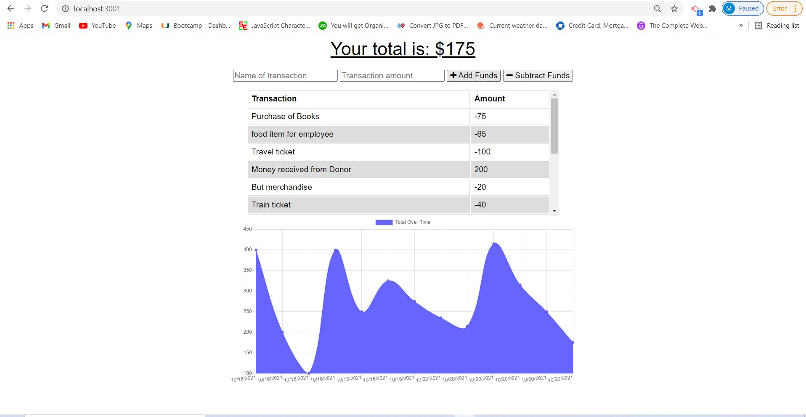
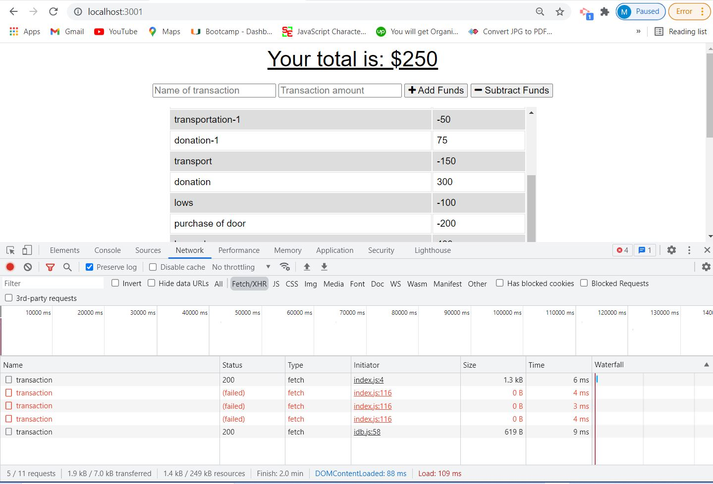
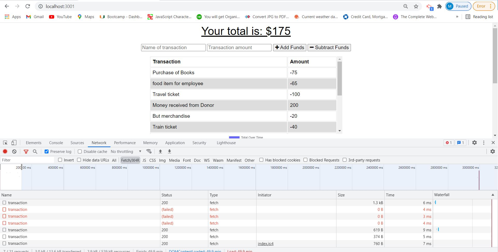
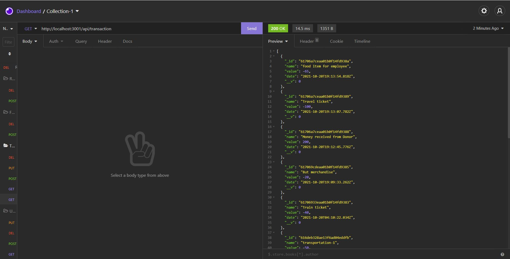

<h1 align="center">BUDGET TRACKER - PWA 👋</h1>

## Description

*Progressive Web Application (PWA) is a type of application software delivered through the web, built using common web technologies including HTML, CSS and JavaScript. It is intended to work on any platform that uses a standards-compliant browser, including both desktop and mobile devices.It resemble native mobile apps and allow users to interact with the application even when there is no internet connection or cell service.*


## Table of Contents

- [Description](#description)
- [Table of Contents](#table-of-contents)
- [App Screenshots](#app-screenshots)
- [Overview Links](#overview-links)
- [User Story](#user-story)
- [Acceptance Criteria](#acceptance-criteria)
- [Installation](#installation)
- [Usage](#usage)
- [Questions](#questions)


## App Screenshots
- Picture of the Home Page of the Application.


- Picture of transaction offline and then adjust after online


- Picture of Transaction - online



- Picture of API Screen shot



## Overview Links
- [Application launched in Heroku](https://budget-tracker-pwa-mirza.herokuapp.com/)
- [Application walkthrough](https://watch.screencastify.com/v/fcRZwppcDGTcG5rVgp0e)
- [GitHub Repository](https://mirzadev.github.io/budget-tracker-pwa/)


## User Story

```text
AS AN avid traveler
I WANT to be able to track my withdrawals and deposits with or without a data/internet connection
SO THAT my account balance is accurate when I am traveling 
```

## Acceptance Criteria

```text
GIVEN a budget tracker without an internet connection
WHEN the user inputs an expense or deposit
THEN they will receive a notification that they have added an expense or deposit
WHEN the user reestablishes an internet connection
THEN the deposits or expenses added while they were offline are added to their transaction history and their totals are updated
```

### Application Functionalities

- The ability to enter deposits offline.
- The ability to enter expenses offline.
- Offline entries should be added to the tracker when the application is brought back online

## Installation
💾     
- npm init --y
- npm i -D webpack webpack-cli
- npm run webpack -v
- npm run build
- npm install -D webpack-bundle-analyzer
- npm install -D file-loader
- npm i image-webpack-loader
- npm i webpack-dev-server -D
- npm run start:dev
- npm i -D webpack-pwa-manifest

## Usage
💻   
  
Run the following command at the terminal:
  
`node server.js`

## Questions
✉️ Contact me with any questions: [email](mailto:awal.mirza2016@gmail.com) , [LinkedIn](https://www.linkedin.com/in/mirza-awal-5972511b5/)

